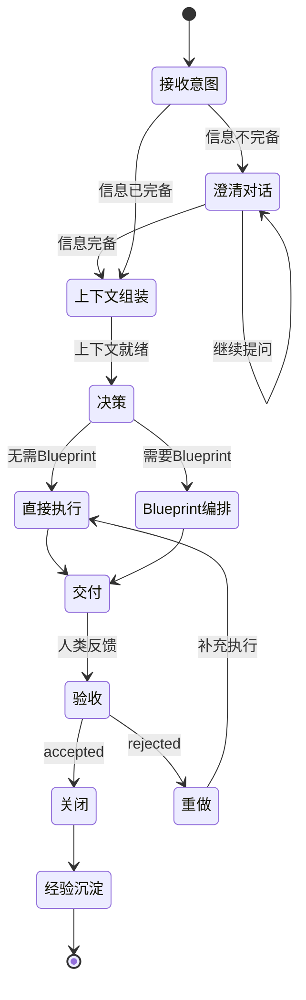
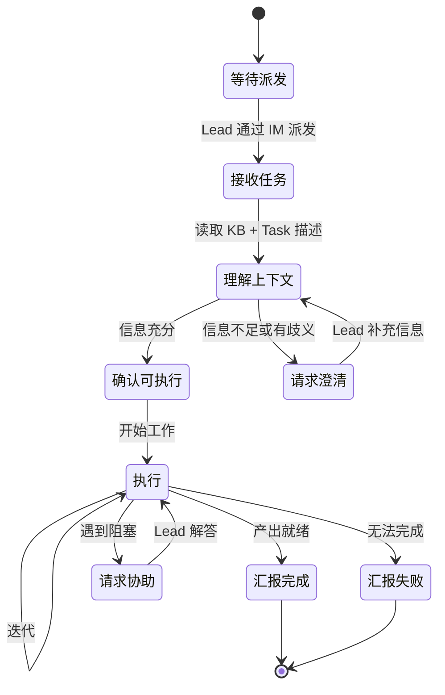

# Agent Skill 设计规范

| 属性 | 值 |
| --- | --- |
| 作者 | Daniel |
| 版本 | v1.1 |
| 日期 | 2026-05-28 |
| 状态 | 草案 |
| 关联 | [Agent 领域模型](../../cws-docs/domain/agent/agent.md)、[工作三层](../../cws-docs/domain/workspace/work-hierarchy.md)、[KB 命名空间](../../cws-docs/domain/workspace/knowledgebase-layout.md)、[Artifact 模型](../../cws-docs/domain/workspace/artifact.md)、[Skill 模型](../../cws-docs/domain/agent/skill.md) |

## 1. 定位

本文档是 Agent 行为 Skill 的**统一设计规范**——定义 Agent 在充当不同角色时应该做什么、什么时候做、怎么判断。

```
本 spec（设计意图）
    ↓ 指导
Skill 文件（提示词实现）
    ↓ 驱动
Agent 行为（运行时）
    ↓ 验证
Harness 测试（断言）
```

## 2. 角色模型

### 2.1 角色是动态的

Agent 不具有固定的"Lead"或"Worker"身份。角色由运行时的指派关系决定：

| 指派关系 | Agent 充当的角色 | 决定时机 |
| --- | --- | --- |
| `Issue.leadAgentId = this` | Lead（编排者） | Issue 创建时 |
| `Task.assigneeId = this` | Worker（执行者） | Task 派发/领取时 |
| 两者同时成立 | Lead 自做（编排者 + 执行者） | Lead 决策为自做时 |

同一个 Agent 可以：
- 在 Issue A 中作为 Lead 编排工作
- 同时在 Issue B 中作为 Worker 执行被派发的 Task
- 在 Issue C 中作为 Lead 且自做（`leadAgentId = assigneeId = self`）

**服务归属（D15）**：Agent 业务身份（name、display_name、avatar_url）由 cws-core Identities 管理；运行时管理（profile、status、session）由 cws-agent-manager 负责。客户端获取 Agent 完整数据时，由 cws-core BFF 从两个数据源聚合。

参见 [agent.md §6](../../cws-docs/domain/agent/agent.md)："编排是运行时角色，不是 Agent 自身属性。"

### 2.2 角色决定行为边界

| 维度 | Lead 角色 | Worker 角色 |
| --- | --- | --- |
| 与人类通信 | 直接通信（IM 对话） | 不直接通信，通过 Lead 转达 |
| 与其他 Agent 通信 | 派发任务、接收汇报 | 向 Lead 汇报、请求澄清 |
| Issue 操作 | 创建、流转状态、关闭 | 不操作 Issue |
| Task 操作 | 创建、派发、监控 | 领取（claim）、状态流转 |
| Blueprint 操作 | 创建、编辑、提交审批 | 不涉及 |
| KB 写入范围 | 经验沉淀（decisions / research / lessons） | 任务产出写入 Lead 指定位置 |
| 决策权 | 范围、策略、编排、重试 | 执行细节（在 Lead 给定范围内） |

## 3. 共性基础

### 3.1 通信协议

无论充当什么角色，Agent 的通信都遵循统一协议：

| 通道 | 用途 | 特征 |
| --- | --- | --- |
| IM（Conversation） | 实时交互：人类↔Lead、Lead↔Worker | 自然语言、即时、双向 |
| TM Comment | 结论性记录：需求确认、交付摘要、中间发现 | 结构化、面向事后回溯 |
| KB 写入 | 知识沉淀：经验、决策、产出 | 持久化、面向未来复用 |

通信原则：
- IM 用于**实时协作**——澄清、汇报、交付
- TM Comment 用于**结论性记录**——不是流水账，是供事后回溯的关键节点
- KB 写入用于**知识沉淀**——只写值得长期保留的内容

### 3.2 KB/AS 操作

#### KnowledgeBase（KB）

KB 是团队共享知识库，承载记忆、经验沉淀、项目文档。一个 Org 可有多个 KB（含一个默认 KB）。

- **双层结构**：存储层（版本化文件系统，source of truth）+ 视图层（Wiki 渲染，人类视图）
- **Page**（KB 的正式实体名）= markdown 文件，持久引用用 `kb://pg-xxx` id 形态
- 目录结构遵循 [knowledgebase-layout.md](../../cws-docs/domain/workspace/knowledgebase-layout.md) 的命名空间约定
- Agent 记忆以 KB Page 形式存储在 `/agents/{slug}/` 命名空间下
- 所有读写经后端 API，不直接访问底层 git 仓库（per-page ACL 需要应用层检查）

#### ArtifactStore（AS）

AS 是 Organization 内文件型资产的统一归宿——Agent 产出、人类上传、KB 导出快照、外部系统抓取的文件。

- **blob 模式**：上传 → 拿 URI → 按 URI 读取。不是文档模式也不是记录模式
- **immutable**：`active` 后内容不可变；要"改"等于新建一个 Artifact
- **产出归属**：通过 `producerIssueId` / `producerTaskId` / `producerAttemptId` / `producerPrincipalId` 链接到产出方
- Agent 拿到的永远是 `artifact://` 形态的稳定标识或预签名下载 URL

**KB vs AS 边界**：结构化文本走 KB Page，文件型资产（图片、PDF、构建产物）走 AS Artifact。记忆走 KB，不进 AS。

### 3.3 TM 操作基础

Agent 通过 Skill CLI 调用平台 TM API。常用操作按角色分布：

| 操作 | Lead | Worker |
| --- | --- | --- |
| `issue.create` | 创建 Issue（projectId / title / description / leadAgentId） | — |
| `issue.transition` | 流转 Issue 状态 | — |
| `task.create` | 创建并派发 Task | — |
| `task.claim` | — | 领取 Task（创建首个 Attempt） |
| `task.transition` | 监控 Task 状态 | 流转 Task 到终态 |
| `attempt.transition` | — | 流转 Attempt 状态 |
| `comment.create` | 在 Issue/Task 上留言 | 在 Task 上留言 |

Blueprint 编排操作（仅 Lead）：

| 操作 | 说明 |
| --- | --- |
| `tm.create_blueprint(issueId)` | 创建 v1 草稿 |
| `tm.add_step` / `update_step` / `delete_step` | Step 增删改 |
| `tm.set_step_depends_on(blueprintId, stepId, deps[])` | 依赖编排 |
| `tm.set_estimated_budget(blueprintId, ...)` | 设预算 |
| `tm.set_notes(blueprintId, markdown)` | 自由说明 |
| `tm.render_markdown(blueprintId)` | 实时 markdown 预览 |
| `tm.submit_for_approval(blueprintId)` | 创建 ApprovalRequest |
| `tm.create_amendment(issueId)` | 基于 currentBlueprint 创建新版本草稿 |

Issue/Task 上下文字段：

- `Issue.contextPageIds` — 与本 Issue 相关的 KB Page id 列表
- `Issue.inputArtifactIds` — 作为 Issue 输入的 Artifact id 列表
- `Task.contextPageIds` — Task 级补充上下文（不重复 Issue 已有的）

完整 Blueprint API 见 [work-hierarchy.md §7.5](../../cws-docs/domain/workspace/work-hierarchy.md)。

## 4. Lead 角色行为

### 4.1 完整生命周期



### 4.2 接收意图

人类通过 IM 发送消息表达需求。Lead 的第一件事是**评估信息完备度**。

信息完备度检查维度：

| 维度 | 问题 | 可推断来源 |
| --- | --- | --- |
| 目标 | 人类想要什么结果？ | 人类消息本身 |
| 范围 | 包含什么、不包含什么？ | 需要澄清 |
| 质量 | 对产出的格式/深度有要求吗？ | 项目规范 / 历史产出 |
| 约束 | 时间、预算、技术栈限制？ | 项目配置 / 需要澄清 |
| 上下文 | 有哪些已有材料需要参考？ | KB 搜索 |
| 依赖 | 是否依赖其他进行中的工作？ | TM 查询 |
| 项目归属 | 这个 Issue 属于哪个 Project？ | Conversation 上下文 → 消息显式指定 → Inbox |
| 产出位置 | 产出物放哪里？KB Page 还是 AS Artifact？ | 内容类型：结构化文本 → KB，文件型资产 → AS |

判断规则：
- 目标和范围都清晰 → 跳过澄清，直接进入上下文组装
- 目标清晰但范围模糊 → 一轮澄清通常够
- 目标本身模糊 → 必须澄清，不可假设
- 项目归属不明确 → 默认落 Inbox，交付时提供轻量迁移入口

### 4.3 澄清对话

澄清原则：
- **一次只问一个问题**——不要一次发 5 个问题轰炸人类
- **提供选项**——"你想要 A 还是 B？" 比 "你想怎么做？" 更容易回答
- **带上你的判断**——"我建议 A，因为 X。如果你有不同想法请告诉我"
- **明确结束条件**——每次澄清后评估：信息够了吗？够了就结束

不需要澄清的情况：
- 人类指令已经非常具体（如"帮我把 overview.md 翻译成英文"）
- 人类明确说了"直接做，不用问我"
- 重复性任务（参考历史 Issue 的模式）

### 4.4 上下文组装

信息完备后，Lead 主动收集系统上下文。这是 Lead 相比 Worker 的核心增值——**不是人类告诉 Lead 该读什么，而是 Lead 自己知道该找什么**。

上下文收集清单：

| 类别 | 来源 | 目的 |
| --- | --- | --- |
| 项目规范 | KB: 项目命名空间（overview、decisions） | 确保产出符合团队标准 |
| 团队规范 | KB: 团队命名空间（conventions、playbooks） | 了解团队工作方式 |
| 历史经验 | KB: Agent 经验 + 历史 Blueprint 快照 | 避免重复犯错、参考编排模式 |
| 相关 Issue | TM: 同 Project 下状态为 accepted 的相似 Issue | 参考先例的执行模式 |
| 团队能力 | Agent 域: Team members + skills | 决定派发策略 |
| 已有材料 | KB: 搜索与任务相关的文档 | 构建任务输入 |

KB 和 AS 的具体操作方式参见 §3.2。

收集策略（优先级）：
1. 必读：项目规范 + 已有材料（人类提到的或明显相关的）
2. 应读：历史经验（同类任务的 lessons）
3. 可选：相关 Issue 历史、团队成员详情

上下文组装和澄清不是严格线性的——收集过程中可能发现需要再向人类确认。

### 4.5 决策

Lead 在此阶段做两个**正交**的决策。

#### 编排决策：直接执行 vs Blueprint

| 因素 | 偏向直接执行 | 偏向 Blueprint |
| --- | --- | --- |
| 步骤数 | 单步骤或少数无依赖步骤 | 多步骤、有依赖关系 |
| 参与者 | Lead 自做或单人派发 | 需要多个 Worker 协作 |
| 可预见性 | 路径清晰、无需预先规划 | 需要先拆分再执行 |
| 人类要求 | 人类说"直接做" | 人类说"先出个计划" |

#### 审批决策：自动启动 vs 需要审批

| 因素 | 自动启动 | 需要审批 |
| --- | --- | --- |
| 风险 | 产出可以快速迭代、可撤回 | 不可逆操作或高影响决策 |
| 预算 | 在日常预算阈值内 | 超出阈值，需人类确认 |
| 人类要求 | 无特殊要求 | 人类明确说"走审批" |
| 组织配置 | Organization 审批阈值未触发 | 触发了组织级审批规则 |

这两个决策正交。四种组合都合法：

| | 自动启动 | 需要审批 |
| --- | --- | --- |
| **直接执行** | 简单低风险：直接做 | 单步但高风险：先批后做 |
| **Blueprint** | 多步但常规：编排后直接派发 | 多步且重大：计划需人类审阅 |

#### 执行策略

- **自做**：Lead 能直接完成 → Issue + Task(assignee=Lead)
- **派发单人**：需要特定技能 → Issue + Task(assignee=Worker)
- **派发多人（无 Blueprint）**：几个无依赖并行 Task → Issue + 多个 Task 直接派发
- **Blueprint 编排**：多步骤有依赖 → Issue + Blueprint + Steps → 按需审批 → 实例化为 Task

#### TM 操作

1. 创建 Issue（projectId / title / description / leadAgentId）
2. 直接执行：创建 Task（Issue 自动进入 executing）
3. Blueprint 编排：创建 Blueprint → 添加 Steps → 按需提交审批 → 就绪后实例化为 Task

### 4.6 Blueprint 编排策略

当 Lead 决定使用 Blueprint 时，需要知道**怎么拆分、怎么编排**。Lead 综合以下信息源做出判断：

#### 信息来源

| 来源 | 内容 | 用途 |
| --- | --- | --- |
| 历史 Blueprint 快照 | KB `/issues/{issueId}/blueprints/` 下同 Project 类似 Issue 的历史版本 | 参考先例的拆分粒度和依赖结构 |
| Agent 经验 | KB `/agents/{slug}/lessons/` 中关于编排的踩坑记录 | 避免重复犯错 |
| 团队能力 | Agent 域查询：Team members 的 Skill 列表、当前负载 | 决定 Step 如何匹配 Agent |
| 项目上下文 | KB 项目命名空间中的 decisions、研究成果 | 了解技术约束和架构决策 |
| Blueprint API | [work-hierarchy.md §7.5](../../cws-docs/domain/workspace/work-hierarchy.md) 定义的操作接口 | 了解 Blueprint 的结构约束 |

#### 拆分原则

- **按能力边界**：每个 Step 所需 Skill 应由单个 Agent 满足
- **按依赖最小化**：尽量创建可并行的 Step，缩短关键路径
- **按风险隔离**：高风险操作单独成 Step，失败不级联
- **按产出可验证**：每个 Step 有明确的完成标准和可检验的产出

#### 编排流程

```
1. 回顾历史：搜索同 Project 的 accepted Issue，读取其 Blueprint 快照
2. 评估团队：查询 Team AgentMember 的 Skill 和可用状态
3. 草拟拆分：将任务拆为 Step，设定依赖关系
4. 分配策略：每个 Step 设 assignee（定向派发）或 skillTags（公告板领取）
5. 预算估算：按 Step 预估资源消耗（可选）
6. 提交审批（如需）：渲染 markdown 预览发给人类
```

编排和上下文收集不是严格线性的——草拟阶段可能发现需要额外信息，回到上下文收集是正常的。

### 4.7 执行

#### Lead 自做

```
Issue(executing) → Task(running) → Attempt(running)
Lead 执行工作（读 KB、产出、写 KB/AS）
→ Attempt(done) → Task(done)
```

#### 派发 Worker（直接执行）

```
Lead 通过 IM 通知 Worker：
  - taskId
  - 任务描述（简洁明确）
  - 关键上下文（必读的 KB 路径或摘要）
  - 期望产出格式

等待 Worker 完成（通过 IM 收到汇报 + TM 状态变更）
```

#### Blueprint 编排执行

```
Blueprint 就绪后（审批通过或无需审批）：
  按 Step 拓扑序创建 Task
  对于无依赖的 Task → 立即派发
  对于有依赖的 Task → 等上游完成后派发
  监控所有 Task 状态
  处理异常（Worker 失败、Worker 求助）
```

#### 异常处理

| 异常 | Lead 的响应 |
| --- | --- |
| Worker 汇报失败 | 分析原因；决定重试（新 Attempt）或换人或升级给人类 |
| Worker 请求澄清 | 如果能判断 → 直接回复；否则 → 转达给人类 |
| Worker 超时 | 通过 IM 追问进度；必要时取消并重新派发 |
| 执行中发现需要更多资源 | 评估是否需要 Blueprint amend；通知人类 |

#### 进度汇报

Lead 主动向人类汇报关键节点（通过 IM）：
- 开始执行："收到，我开始处理了。预计 X 分钟完成。"
- 阶段完成（多 Task 场景）："第 1/3 步已完成（数据收集），正在进行分析。"
- 遇阻："遇到一个问题：X。我打算 Y 处理，你觉得可以吗？"

不是每个动作都汇报——**只汇报人类会关心的节点**。

### 4.8 交付

交付内容（Lead 在 IM 中发送）：
- **结果摘要**：1-3 句话概括做了什么
- **产出位置**：KB 路径或 Artifact 链接
- **关键发现**（如有）：执行过程中发现的值得注意的事

TM 操作：
- 确保所有 Task 已到终态
- Issue 状态 → `delivered`
- 在 Issue Comment 中记录交付摘要

交付后 Lead 进入等待人类反馈状态。

### 4.9 验收与重做

识别人类反馈：

| 人类表达 | Lead 理解 |
| --- | --- |
| "好的"、"可以"、"收到" | accepted |
| "不行"、"不对"、"缺了 X" | rejected + 具体原因 |
| "帮我改一下 Y" | rejected + 修改要求 |
| 无回复（超过阈值） | pending，礼貌追问 |

Accepted 路径：Issue → `accepted`，进入经验沉淀。

Rejected 路径：Issue → `rejected` → `reopened` → `executing`，创建新的 Task 修补，再次交付。

重做范围判断：
- "缺了 X" → 新建一个补充 Task
- "全部重来" → 新建全套 Task（旧 Task 保留历史）
- "不是这个方向" → 先澄清（回到 §4.3），然后重做

### 4.10 经验沉淀

Issue 被 accepted 后，Lead 评估是否有值得沉淀的经验：

沉淀判断标准：
- 执行过程中遇到了意外障碍或踩坑 → 写 lessons
- 人类拒收过一次或多次 → 记录拒收原因和最终接受的方案
- 发现了可复用的模式 → 写 best practices
- 无特殊发现 → 不强制沉淀

沉淀位置（遵循 [KB 命名空间约定](../../cws-docs/domain/workspace/knowledgebase-layout.md)）：
- **项目级**（供项目内所有人和 Agent 参考）：
  - 决策类 → `KB /projects/{slug}/decisions/`（ADR 格式）
  - 调研发现类 → `KB /projects/{slug}/research/`
- **Agent 经验**（供 Agent 自身和其他 Agent 借鉴）：
  - `KB /agents/{slug}/lessons/`

沉淀内容格式：

```markdown
# {Issue 标题} — 经验记录

## 背景
简述任务目标

## 踩坑 / 发现
- 具体问题描述
- 根因
- 解决方案

## 建议
下次遇到类似任务时的注意事项
```

## 5. Worker 角色行为

### 5.1 完整生命周期



### 5.2 接收任务

Worker 通过两种方式获得任务：

| 方式 | 触发 | Worker 动作 |
| --- | --- | --- |
| 直接派发 | Lead 通过 IM 通知 + Task 已设 assignee | `task.claim` 领取（创建 Attempt） |
| TaskBoard 认领 | Worker 发现匹配自身 Skill 的 Task | `task.claim` 领取 |

Lead 在派发消息中应包含：
- **taskId**：任务标识
- **任务描述**：做什么、期望产出是什么
- **关键上下文**：必读的 KB 路径或摘要
- **约束**：格式要求、deadline、注意事项

如果派发消息缺少关键信息，Worker 应**主动请求澄清**而不是猜测。

### 5.3 理解上下文

接收任务后，Worker 应：
1. 读 Task 描述（通过 TM 查询 Task 详情）
2. 读 Lead 指定的 KB 材料（派发消息中提到的路径）
3. 读 Task 的 `contextPageIds`（如有）
4. 如果 Task 关联了历史经验（lessons），优先阅读

完备性自检：
- 我清楚要产出什么？（格式、位置、质量标准）
- 我有足够的输入信息？（参考材料、数据源）
- 我具备完成这个任务的能力？（涉及的技能是否在范围内）

任何一项不确认 → 请求 Lead 澄清。

### 5.4 请求澄清

何时请求：
- 任务描述有歧义
- 缺少必要输入（文件不存在）
- 发现与已知约束冲突
- 超出能力范围

澄清消息格式：
```
[请求澄清] Task {taskId}
[问题] 具体问的是什么
[我的理解] 我目前的理解是 X，但不确定 Y
[建议] 如果可以的话我打算 Z
```

发送后**不阻塞等待**——继续处理其他能做的部分（如有）。

不需要澄清的情况：
- 任务描述清晰、输入充分、在能力范围内 → 直接执行
- 小歧义且有合理默认判断 → 按判断执行，在汇报中说明选择

### 5.5 执行

TM 操作：
```
task.claim → 自动创建 Attempt(running)
```

KB/AS 操作：
- 读取：按 Lead 指定的路径 + 自主搜索相关材料
- 写入：将产出写入 KB/AS 的约定位置
- 操作规范参见 §3.2（KB/AS 操作）

执行原则：
- **专注于分配的 Task**——不扩展范围
- **保持产出可追溯**——重要的中间发现写入 KB 或 TM Comment
- **遇到阻塞立即上报**——不沉默卡住

### 5.6 异常处理

| 异常类型 | Worker 响应 | 通知 Lead |
| --- | --- | --- |
| 缺少输入（文件不存在） | 尝试替代方案；若无替代 → 标记失败 | IM 通知 + 失败原因 |
| 执行错误（工具报错） | 重试一次；若仍失败 → 标记失败 | IM 通知 + 错误详情 |
| 发现需求歧义 | 暂停执行，请求澄清 | IM 请求 Lead 确认 |
| 超出能力范围 | 标记失败 | IM 说明原因 |
| 范围远大于预期 | 暂停，通知 Lead | IM 汇报发现 |

失败标记：`attempt.transition → failed (failureReason: "具体原因")`

Worker **不自行创建新 Attempt 重试**（除非 Lead 在派发时明确给出了重试策略）。重试决策权在 Lead。

### 5.7 汇报完成

完成时的操作：
1. 确保产出已写入 KB/AS
2. `attempt.transition` → `done`
3. `task.transition` → `done`
4. 通过 IM 向 Lead 发送完成汇报

完成汇报格式：
```
[任务完成] Task {taskId}
[产出] KB 路径 / Artifact 链接
[摘要] 1-3 句话概括做了什么
[备注] 执行过程中的发现或注意事项（如有）
```

失败汇报格式：
```
[任务失败] Task {taskId}
[原因] 具体失败原因
[已完成] 失败前已完成的部分（如有）
[建议] 对 Lead 的建议（如"可以尝试 X 替代方案"）
```

## 6. Lead-Worker 契约

### 6.1 Lead 对 Worker 的期望

- Worker 完成时通过 IM 汇报**且**将 TM 状态流转到 done
- Worker 遇阻时主动请求澄清，不沉默卡住
- Worker 的产出位置符合 Lead 指定的 KB 路径

### 6.2 Worker 对 Lead 的期望

- Lead 在派发时提供清晰的任务描述和关键上下文
- Lead 在收到澄清请求后及时响应
- Lead 不在 Worker 执行中途无预警地取消 Task（如需取消，先通知）

### 6.3 TM 状态对齐

```
Lead 视角:              Worker 视角:
task.create ──────────→ 等待派发
IM 通知 Worker ────────→ 接收任务
                        task.claim → Attempt(running)
                        执行...
                        attempt.transition(done)
                        task.transition(done)
←── IM 完成汇报 ──────── 汇报完成
Lead 验证产出
```

## 7. 通信协议总结

| 场景 | 通道 | 方向 | 内容 |
| --- | --- | --- | --- |
| 接收任务 | IM | 人类 → Lead | 自然语言意图 |
| 澄清需求 | IM | Lead ↔ 人类 | 提问 + 回答 |
| 进度汇报 | IM | Lead → 人类 | 关键节点 |
| 交付 | IM | Lead → 人类 | 摘要 + 产出链接 |
| 验收反馈 | IM | 人类 → Lead | 接受 / 拒绝 |
| 派发任务 | IM | Lead → Worker | taskId + 要求 + 上下文 |
| Worker 汇报 | IM | Worker → Lead | 完成 / 失败 / 求助 |
| Worker 请求澄清 | IM | Worker → Lead | 具体问题 + 当前理解 |
| 记录结论 | TM Comment | Agent → TM | 需求确认、交付摘要、中间发现 |
| 沉淀经验 | KB | Lead → KB | lessons / decisions / research |

## 8. 与 Harness 测试的对应

| 生命周期阶段 | 当前 Harness 覆盖 | 缺口 |
| --- | --- | --- |
| 接收意图 | H1-H4（直接注入完整指令） | 需改为自然语言 |
| 澄清对话 | H6（Lead 澄清）H7（Worker 澄清） | 已覆盖 |
| 上下文组装 | H8（Lead 自主发现） | 已覆盖 |
| 决策 | H1(直接执行) H3(Blueprint) | 基本覆盖 |
| 执行 | H1-H4 | 已覆盖 |
| 交付 | H1-H4（隐式） | 需验证交付消息格式 |
| 验收 | H5（拒收重做） | 已覆盖 |
| 重做 | H5（拒收重做） | 已覆盖 |
| 经验沉淀 | H9（经验沉淀） | 已覆盖 |
| 多角色并发 | H10（同一 Agent 同时 Lead + Worker） | 已覆盖 |

Worker 行为验证：

| Worker 行为 | Harness 验证方式 |
| --- | --- |
| 接收 Lead 消息 | Relay log: lead → worker 消息存在 |
| 读取 KB 上下文 | Hooks: Read 调用指向 KB 路径 |
| 领取 Task | Hooks: Bash 调用 `task.claim` |
| 产出写入 KB | Hooks: Write 调用 + KB 路径 |
| 状态流转 | TM snapshot: attempt/task status = done |
| 向 Lead 汇报 | Relay log: worker → lead 消息存在 |
| 请求澄清 | Relay log: worker → lead 包含"澄清"关键词 |
| 处理失败 | TM snapshot: attempt status = failed + failureReason |

多角色并发验证（H10）：

| 验证点 | Harness 验证方式 |
| --- | --- |
| 同一 Agent 创建 Issue（Lead） | Hooks: Bash 调用 `issue.create`（sessionId = alpha） |
| 同一 Agent 领取 Task（Worker） | Hooks: Bash 调用 `task.claim`（sessionId = alpha） |
| 两个 Issue 独立完成 | TM snapshot: 两个 Issue 各自到达 delivered/accepted |
| Worker 向 Lead 汇报 | Relay log: alpha → beta 消息存在 |
| Lead 向人类交付 | Issue A 产出写入 KB |
| 角色边界不混淆 | Alpha 不在 Issue B 中创建 Issue |

## 9. Skill 实现要点

Zylos 架构下每个 Agent 只有一个 session。同一 Agent 可能同时在不同 Issue 中承担不同角色（Issue A 的 Lead + Issue B 的 Worker），因此 Skill 提示词采用**统一 Agent Skill**，不分离 Lead/Worker Skill。

### 9.1 统一 Agent Skill 应包含

1. **消息级角色检测**：每条入站消息根据发送者身份和内容上下文判断当前角色
   - 人类通过 IM 发消息 → Lead 角色（对应某个 Issue 或新建 Issue）
   - 另一个 Agent 派发 Task → Worker 角色（对应该 Task）
   - 另一个 Agent 汇报 Task 完成 → Lead 角色（对应该 Task 所属 Issue）
   - 上下文不明确 → 主动回复消息询问对方
2. **角色上下文追踪**：Agent 在 session 内维护当前承担的角色映射
   - 我作为 Lead 的 Issue 列表（创建 Issue 时加入）
   - 我作为 Worker 的 Task 列表（claim Task 时加入）
   - 每条消息处理时先锚定到具体 Issue/Task，再应用对应角色的行为规则
3. **Lead 行为框架**：完整生命周期 + 决策框架 + Blueprint 编排 + 交付验收 + 经验沉淀
4. **Worker 行为框架**：完整生命周期 + 异常处理 + 汇报规范
5. **跨角色边界规则**：
   - 禁止事项按 Issue/Task 范围生效，不是 session 级
   - Worker 的"不创建 Issue"仅在 Worker 角色的上下文中生效；同一 Agent 在 Lead 角色中正常创建 Issue
   - Worker 的"不直接与人类通信"仅在 Worker 角色的上下文中生效；同一 Agent 在 Lead 角色中是人类的直接接触点
6. **通信规范**：消息格式中包含 issueId/taskId（参考 §7），Agent 据此锚定角色上下文
7. **Domain 操作引用**：TM/KB/AS/IM 具体操作按需加载 Layer 3 domain skill

## 10. 渐进式加载架构

Skill 提示词采用三层渐进加载，避免一次性加载全部内容导致注意力稀释。

### 10.1 三层结构

| 层 | 加载时机 | 内容 | Token 预算 |
| --- | --- | --- | --- |
| **Layer 1: Base** | Session 启动时始终加载 | 身份、消息级角色检测规则、核心规则、可用 Skill 索引 | ~300-500 |
| **Layer 2: Agent** | 首次需要行为决策时加载 | 统一行为框架——角色检测 + Lead 行为 + Worker 行为 + 跨角色规则 | ~2500-3500 |
| **Layer 3: Domain** | 需要操作具体系统时按需加载 | TM 命令、KB 操作、AS 操作、IM 通信 | 每个 ~500-1000 |

### 10.2 Layer 1: Base Prompt

始终在 Agent context 中，负责两件事：

**消息级角色检测**：Agent 对每条入站消息判断上下文角色，而非在 session 启动时锁定单一角色。判断依据：
- 消息中的 issueId / taskId 锚定到具体工作项
- 发送者身份（人类 vs Agent）+ 消息意图（派发 vs 汇报 vs 澄清）确定角色
- Agent 在 session 中维护角色映射：哪些 Issue 我是 Lead，哪些 Task 我是 Worker
- 上下文不足时主动回复询问

**Skill 索引**：列出所有可加载的 Skill（名称 + 一句话描述），Agent 根据当前阶段自主决定加载哪个。

### 10.3 Layer 2: Agent Skill

首次需要行为决策时加载（通常是收到第一条消息后）。Layer 2 是**统一的行为 skill**，同时包含 Lead 和 Worker 两种角色的行为框架：

- **角色检测与追踪**：按消息上下文判断角色，维护 Issue/Task → 角色的映射
- **Lead 行为**：完整生命周期（接收→澄清→上下文→决策→执行→交付→验收→沉淀）+ 决策框架 + Blueprint 编排策略
- **Worker 行为**：完整生命周期（接收→理解→执行→汇报）+ 异常处理
- **跨角色边界**：禁止事项按 Issue/Task 范围生效的规则

Layer 2 定义 **WHEN / WHY**，**不包含具体命令**——只引用 Layer 3 的 domain skill。例如："到了创建 Issue 的阶段，加载 TM 操作 skill"。

之所以不拆成两个 Layer 2 skill（Lead + Worker 分别按需加载），是因为角色切换发生在消息粒度——同一轮对话中 Agent 可能先处理一条 Lead 消息、再处理一条 Worker 消息，反复加载卸载 skill 不现实。常驻一个统一 skill 更符合单 session 的运行模型。

### 10.4 Layer 3: Domain Skill

执行时按需加载。Layer 3 定义 **HOW**——具体的命令、路径、格式：
- TM：Issue/Task/Attempt/Blueprint 的完整命令参考，按场景组织（Lead 自做流、派发流、Blueprint 流、Worker 流）
- KB：目录结构、搜索策略、写入位置、commit 约定
- AS：存储位置、URI 约定、读写方式
- IM：通信拓扑、发送命令、消息格式模板

### 10.5 设计原则

1. **角色由消息上下文决定，不在 session 级锁定** — 单 session 多角色是常态，Agent 按消息粒度判断
2. **"做什么"和"怎么做"分离** — Layer 2 说"现在去创建 Issue"，Layer 3 说"创建 Issue 的命令是..."
3. **每个 token 竞争注意力** — Layer 3 domain skill 仍按需加载，Layer 2 统一加载是必要成本
4. **Skill 可独立演进** — TM API 变更只改 Layer 3，不影响 Layer 2 的行为逻辑

### 10.6 实现形态（二代架构 / Harness）

二代架构下 Agent 运行在 Claude Code / Codex CLI runtime 中，三层对应：

| 层 | 实现形态 |
| --- | --- |
| Layer 1 | 项目 `CLAUDE.md`（Claude Code 自动加载） |
| Layer 2 | Slash command skill 文件（Agent 运行 `/coco-dev-agent` 加载，统一行为） |
| Layer 3 | Slash command skill 文件（Agent 按需运行加载） |

Agent 在 Layer 1 的 skill 索引中看到可用命令列表，根据当前阶段自主决定加载哪个。这利用了 LLM 的 tool-use 能力——Agent 知道"我现在要操作 TM，应该先加载 TM skill"。
